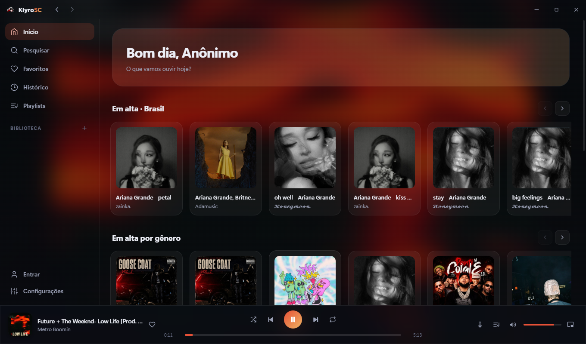
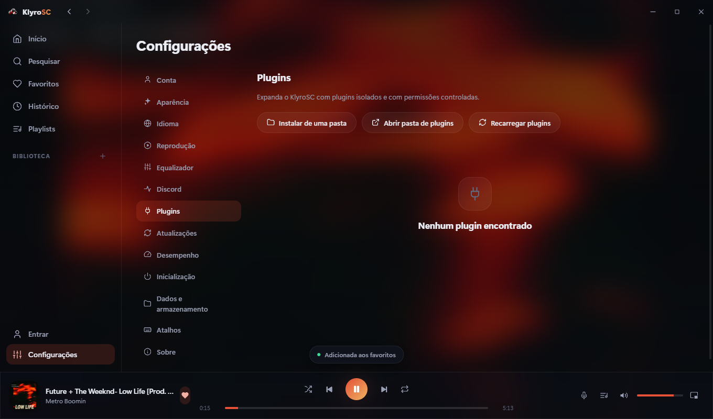
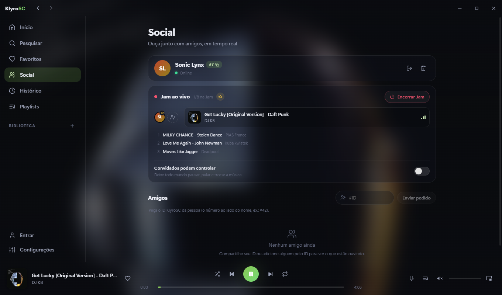
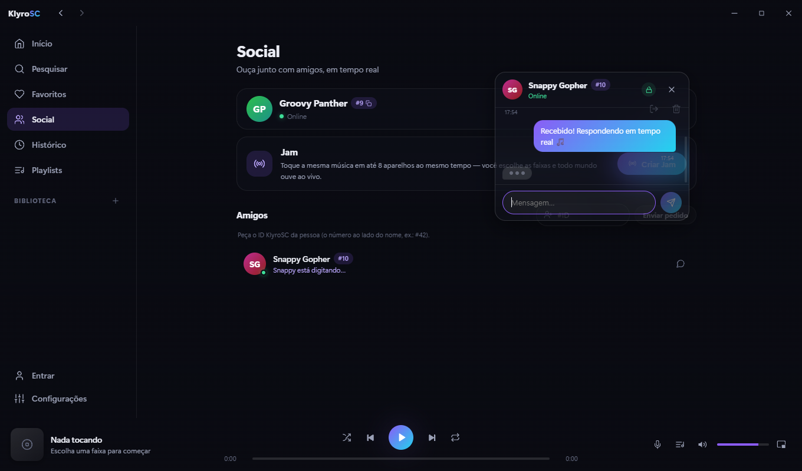
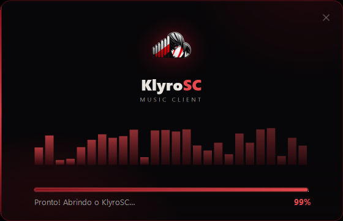
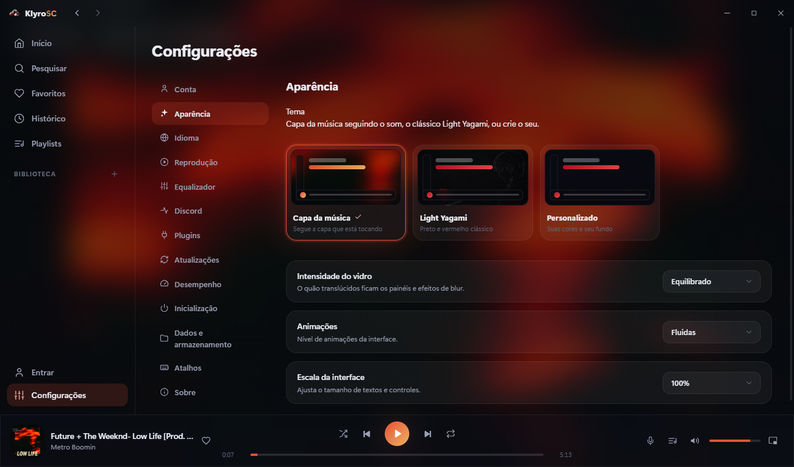

<div align="center">


# KlyroSC

**O SoundCloud do jeito que ele deveria ser.**
SoundCloud Modded by: Felipe and Yusuro

[](https://github.com/Felipwe/KlyroSC/releases/latest)

[-1f1f1f?style=for-the-badge&logo=apple)](https://github.com/Felipwe/KlyroSC/releases/latest)
[](https://github.com/Felipwe/KlyroSC/releases/latest)

[](https://github.com/Felipwe/KlyroSC/releases/latest)
[](https://github.com/Felipwe/KlyroSC/releases)
[](LICENSE)
[](https://github.com/Felipwe/KlyroSC/releases/latest)

</div>

---

## Prints

> Tema padrão **Capa da música**: o fundo e as cores do app seguem, ao vivo, a capa do que está tocando.

| Início | Plugins |
| :---: | :---: |
|  |  |

| Social + Jam ao vivo | Chat criptografado |
| :---: | :---: |
|  |  |

| Instalador próprio | Configurações |
| :---: | :---: |
|  |  |

## O que tem

- [x] **Player nativo**  sem site embutido, sem anúncio de áudio, nunca
- [x] **KlyroSC Socials**  conta anônima estilo Mullvad: sem e-mail, sem senha  você ganha um nome aleatório (tipo “Bold Zebra”), um ID (#42) e um código secreto de 16 dígitos que é sua única chave
- [x] **Jam ao vivo**  ouça a mesma música com até 8 amigos em tempo real, com convite, fila sincronizada e controle do dono (libere ou trave pause/skip dos convidados)
- [x] **Chat criptografado de ponta a ponta**  X25519 + AES-GCM, o servidor só vê texto cifrado; com indicador de “digitando…” ao vivo
- [x] **Amigos por ID**  adicione pelo #ID, veja quem está online e o que cada um está ouvindo em tempo real
- [x] **Tema Capa da música**  fundo e cores acompanham a capa da faixa em tempo real (padrão), com Light Yagami e temas 100% personalizados (suas cores, seu fundo, seus perfis, exportar/importar)
- [x] **Equalizador de 10 bandas**  presets prontos (Rock, Grave, Agudos…), presets seus ilimitados e compartilháveis por arquivo
- [x] **Em alta do seu país de verdade**  as mais tocadas do dia no Brasil, casadas com o SoundCloud
- [x] **AdBlock nativo**  bloqueia 40+ redes de anúncio/rastreio e conteúdo patrocinado
- [x] **Region Unblock**  destrava faixas bloqueadas no seu país via rota de embed
- [x] **Login com SoundCloud**  curtir, republicar e comentar valem na sua conta real (opcional)
- [x] **Letras sincronizadas**  em tempo real, com busca inteligente que acha até título sujo
- [x] **Discord Rich Presence**  mostra o que você está ouvindo, limpo e sem poluição
- [x] **Biblioteca local**  favoritos, playlists arrastáveis com capa personalizada e histórico por dia
- [x] **Fila completa**  shuffle, repeat, mini player flutuante e atalhos de teclado
- [x] **Mix da pesquisa**  tocou uma música da busca? A fila continua com faixas parecidas, não com a mesma música repetida
- [x] **Plugins**  liga/desliga tudo: Last.fm scrobbler, sleep timer, notificações e mais
- [x] **Atualização automática**  já vem ativada, baixa e instala sozinho
- [x] **Instalador próprio**  animado, preto/vermelho, limpa versões antigas sozinho
- [x] **PT-BR e inglês**  detecta o idioma do sistema

## Como instalar

**Windows**

1. Baixa o [`KlyroSC-Setup.exe`](https://github.com/Felipwe/KlyroSC/releases/latest)
2. Roda. Ele instala em segundos e abre sozinho.
3. Só isso. Atualizações chegam automaticamente.

> Se o Windows mostrar “fornecedor desconhecido”, clique em **Mais informações → Executar assim mesmo**  é só porque o app ainda não tem assinatura digital paga.
>
> Tinha o KlyroSC 1.x? O instalador remove a versão antiga sozinho, sem duplicar nada.

**macOS** (Apple Silicon)

1. Baixa o `.dmg` na [última release](https://github.com/Felipwe/KlyroSC/releases/latest) e arrasta para Aplicativos
2. Na primeira vez: clique com o botão direito no app → **Abrir** (necessário porque o app não é assinado)

**Linux**

- **AppImage**: baixa, dá permissão (`chmod +x KlyroSC-*.AppImage`) e executa
- **Debian/Ubuntu**: baixa o `.deb` e instala com `sudo dpkg -i klyrosc_*.deb`

## Assinatura de código

O KlyroSC não coleta nenhum dado do usuário tudo fica salvo localmente no seu computador.

Free code signing on Windows provided by [SignPath.io](https://signpath.io), certificate by [SignPath Foundation](https://signpath.org).

## KlyroSC Socials

A aba **Social** conecta você aos amigos sem pedir nenhum dado pessoal:

- **Conta em 1 clique**: o app gera um nome aleatório (“Bold Zebra”), um ID público (#42) e um código secreto de 16 dígitos  igual Mullvad. O código é a única chave da conta: sem e-mail, sem senha, sem recuperação.
- **Amigos**: adicione pelo #ID, aceite ou recuse pedidos, veja quem está online e o que estão ouvindo ao vivo.
- **Jam**: até 8 pessoas ouvindo a mesma música em tempo real. O dono convida, controla e decide se os convidados podem pausar/trocar música. Jam parada encerra sozinha.
- **Chat E2E**: mensagens criptografadas de ponta a ponta (X25519 + HKDF + AES-256-GCM) em janelas flutuantes — arraste, redimensione e mantenha várias conversas abertas ao mesmo tempo. As chaves privadas nunca saem do seu computador — o servidor só armazena e repassa texto cifrado.
- **Perfil do seu jeito**: foto de perfil opcional (recortada e comprimida localmente) junto do nome aleatório e do #ID.
- **Backend privado** em Railway (Node + Postgres + WebSocket), com rate limiting, sessões com hash e zero endpoints públicos sem autenticação.

## Stack


## Rodando do código

```bash
git clone https://github.com/Felipwe/KlyroSC.git
cd KlyroSC
npm install
npm run dev        # desenvolvimento com hot reload
npm run dist:win   # gera o instalador em dist/
```

Quer criar um plugin? A API tá documentada em [docs/PLUGINS.md](docs/PLUGINS.md).

## Licença

[MIT](LICENSE)  feito por [Felipwe](https://github.com/Felipwe)
